# PM System — 用戶手冊

> **對象**：所有 PM System 用戶（Admin / PM / Tech Lead / Developer / Tester）
> **目的**：step-by-step 教學，每個 page 都有截圖
> **更新日期**：2026-06-08
> **系統網址**：`http://localhost:8080`（Docker 本地）／ `https://pm.your-company.com`（生產，待部署）

---

## 目錄

1. [快速開始](#1-快速開始)
2. [登入與個人資料](#2-登入與個人資料)
3. [儀表板](#3-儀表板)
4. [項目管理](#4-項目管理)
5. [需求管理](#5-需求管理)
6. [任務管理](#6-任務管理)
7. [缺陷追蹤](#7-缺陷追蹤)
8. [工作時數](#8-工作時數)
9. [報表](#9-報表)
10. [AI 助手（Chat）](#10-ai-助手chat)
11. [Wiki 與文件](#11-wiki-與文件)
12. [用戶、部門、角色管理](#12-用戶部門角色管理)
13. [AI Agent 管理](#13-ai-agent-管理)
14. [角色權限（RBAC）速覽](#14-角色權限rbac-速覽)
15. [常見問題 FAQ](#15-常見問題-faq)

---

## 1. 快速開始

### 1.1 系統簡介

PM System 係公司內部嘅項目管理平台，集中管理：

- **項目** — 每一個 product / initiative
- **需求** — 每個項目入面要解決嘅問題
- **任務** — 將需求拆細成可執行嘅工作
- **缺陷** — 開發過程中發現嘅 bug
- **工時** — 同事填報每日工作時數
- **AI 助手** — 用自然語言操作上面所有嘢

### 1.2 你需要嘅嘢

| 嘢 | 點樣攞 |
|---|---|
| 瀏覽器 | Chrome / Edge / Safari（建議最新版） |
| 帳號 | 問 Admin 開 account |
| 密碼 | 第一次登入之後去 [個人資料] 改 |

### 1.3 角色 vs 權限

| 角色 | 默認可以… |
|------|----------|
| **Admin** | 全部操作，包括開 user、改 role |
| **PM** | 管項目、起需求、分派任務、睇報表 |
| **Tech Lead** | 分派任務、審批需求 |
| **Developer** | 睇 + 更新自己嘅任務、填工時 |
| **Tester** | 睇全部 + 起 bug |
| **自定義** | Admin 喺「角色權限」自訂 |

詳細 permission key 見 [第 14 節](#14-角色權限rbac-速覽)。

---

## 2. 登入與個人資料

### 2.1 登入

打開系統網址，見到登入頁：

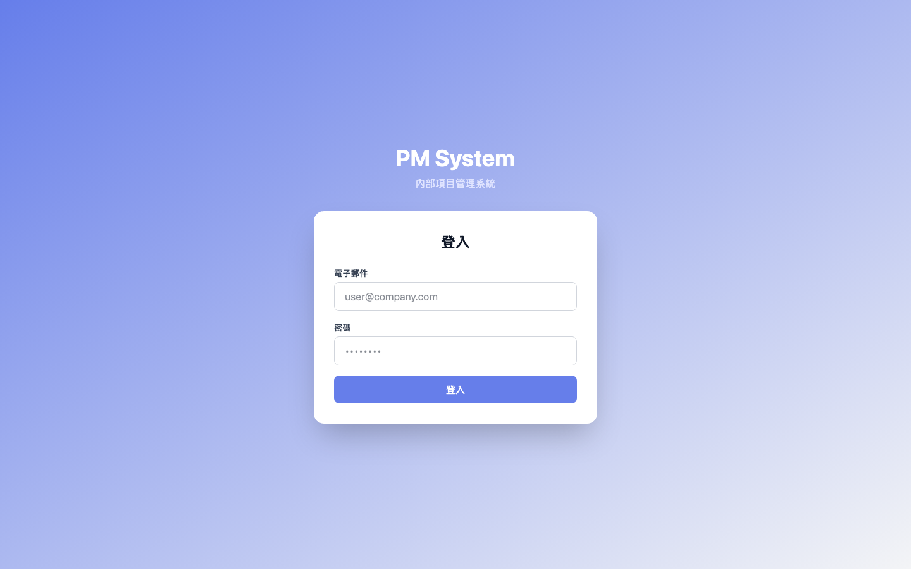

**步驟**：
1. 輸入 **電子郵件**（Admin 畀你嘅 email）
2. 輸入 **密碼**
3. 撳「**登入**」

> ⚠️ **如果唔見到「項目」等選單**：代表你嘅 role 冇對應 permission。聯絡 Admin 改 role（見 [第 12.3 節](#123-角色權限)）。

### 2.2 預設測試帳號（只喺 Dev 環境用）

| 角色 | Email | 密碼 |
|------|-------|------|
| Admin | `admin@test.com` | `admin123` |
| PM | `pm@test.com` | `pm123` |
| Tech Lead | `techlead@test.com` | `tl123` |
| Developer | `dev@test.com` | `dev123` |
| Tester | `tester@test.com` | `test123` |
| AI Agent | `agent-dev1@test.com` | `agent123` |

> 🔒 **生產環境唔會有呢啲帳號**。Dev 先 seed。

### 2.3 個人資料頁

撳左下角你個名 → 進入「個人資料」：

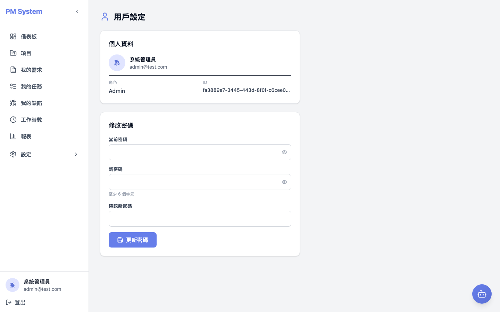

呢度可以改：
- 顯示名稱
- 頭像
- 密碼
- 通知偏好

---

## 3. 儀表板

登入之後第一個見到嘅係「儀表板」：

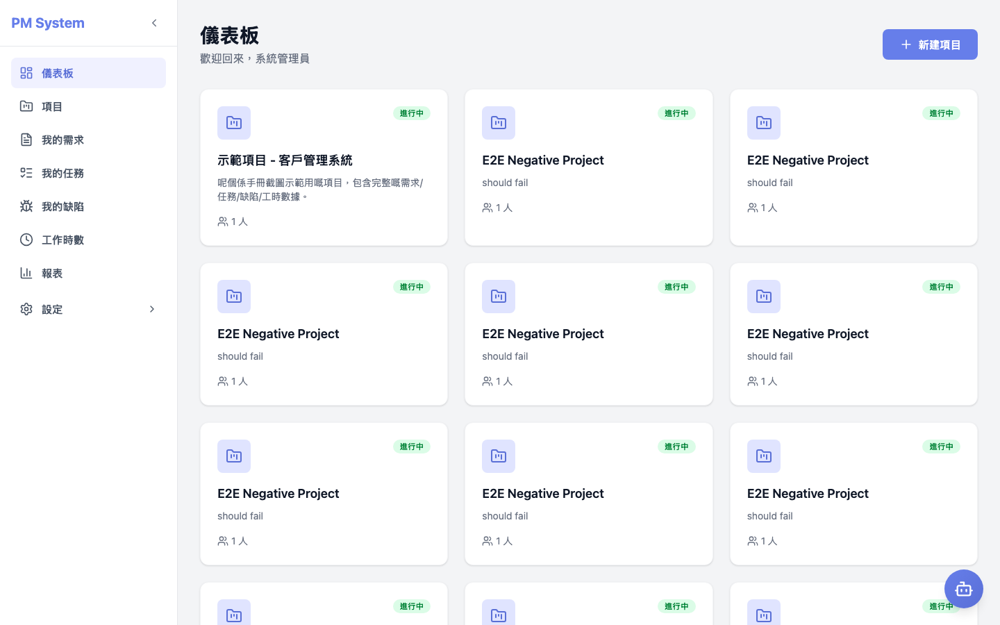

儀表板集中展示：

| 區塊 | 內容 |
|------|------|
| **項目總覽** | 你參與緊嘅項目卡片，狀態、進度、成員數 |
| **待辦任務** | 分配畀你、仲未完成嘅任務 |
| **最近活動** | 系統 / 同事嘅最新動態 |
| **工時本週** | 本週已填工時 vs 目標時數 |

---

## 4. 項目管理

### 4.1 項目列表

撳左邊「**項目**」：

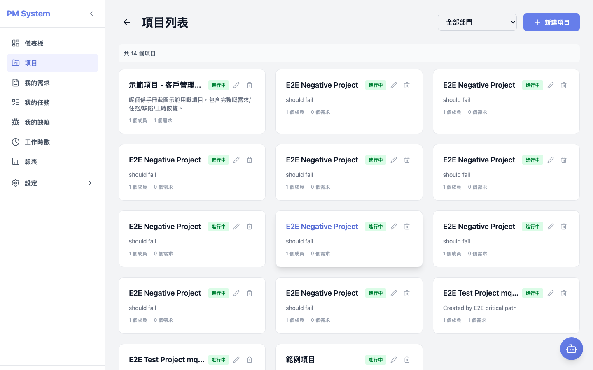

每張項目卡顯示：
- 項目名稱 + 狀態（active / paused / completed）
- 部門
- 成員數 / 需求數
- 創建日期

### 4.2 新建項目

撳右上角「**+ 新建項目**」掣，會彈出 modal：

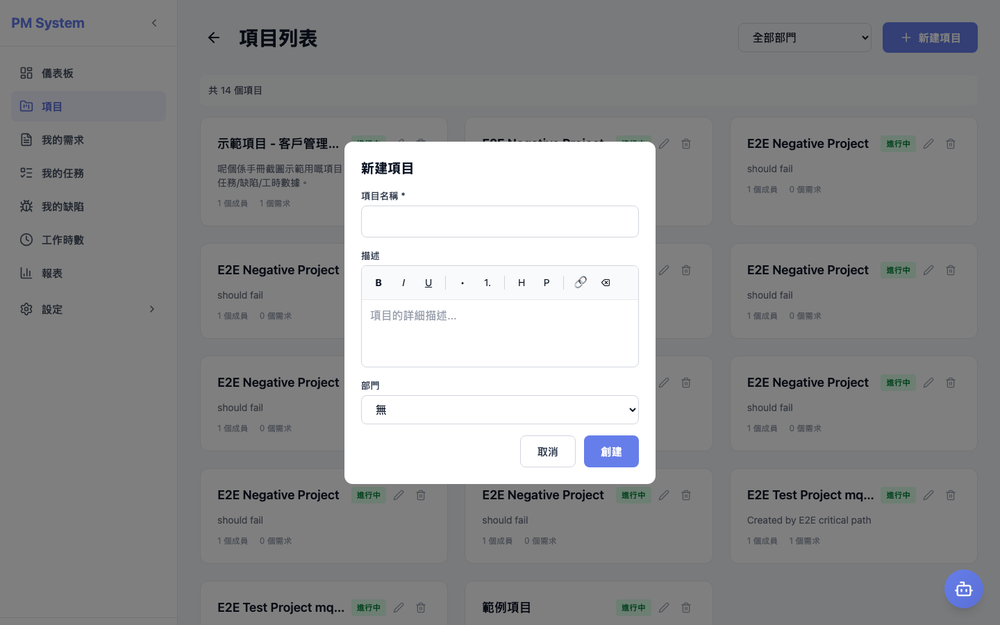

填寫：
- **名稱**（必填）— 例：「客戶管理系統 v2」
- **描述** — 項目目標、範圍
- **狀態** — 預設 `active`
- **部門** — 揀所屬部門（可選）

撳「**建立**」就完成。

### 4.3 項目詳情

撳項目卡進入詳情頁，會見到 8 個 tab：

| Tab | 內容 |
|-----|------|
| **需求** | 項目入面所有需求列表 |
| **任務** | 項目入面所有任務列表 |
| **缺陷** | 項目入面所有 bug |
| **看板** | Kanban 拖拽視覺化任務進度 |
| **成員** | 項目成員 + 角色 |
| **Wiki** | 項目 Wiki 頁面 |
| **附件** | 上傳嘅文件 |
| **Agent 任務** | 派畀 AI Agent 嘅任務 |


頁面頂部有 **Agent 派工 banner**（綠色），可以將任務派畀 AI Agent 自動執行。

---

## 5. 需求管理

### 5.1 我的需求

撳左邊「**我的需求**」：

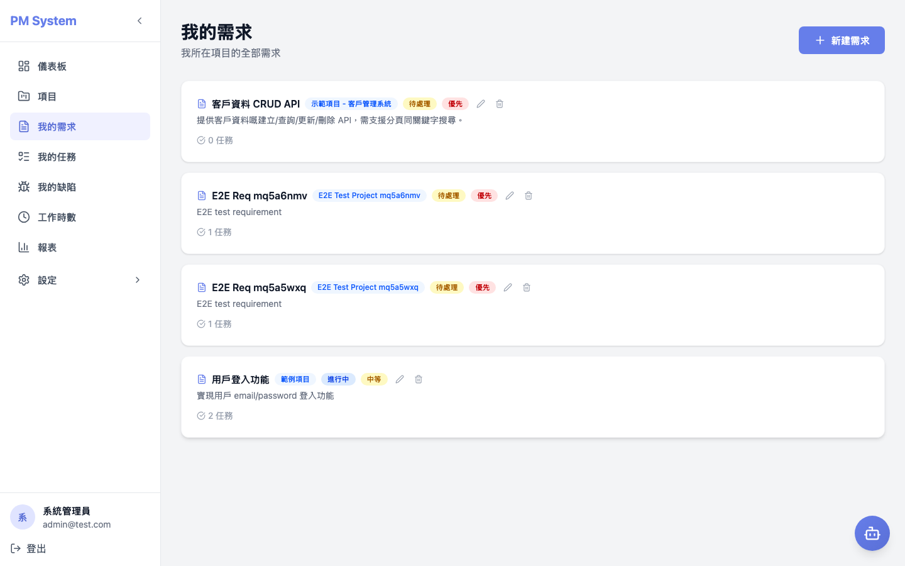

呢度只顯示「**分配畀你 / 你起咗嘅**」需求。每張卡顯示：
- 標題
- 優先級（high / medium / low）
- 狀態（draft / open / in_progress / completed / cancelled）
- 創建日期

### 5.2 需求詳情

撳需求卡進入詳情：

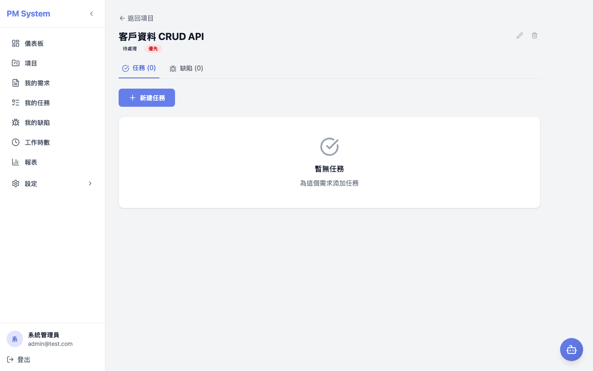

可以做：
- 改標題 / 描述（rich text editor）
- 改優先級、狀態
- 分配負責人
- 將需求轉去 Task（拆細成可執行工作）

---

## 6. 任務管理

### 6.1 我的任務

撳左邊「**我的任務**」：

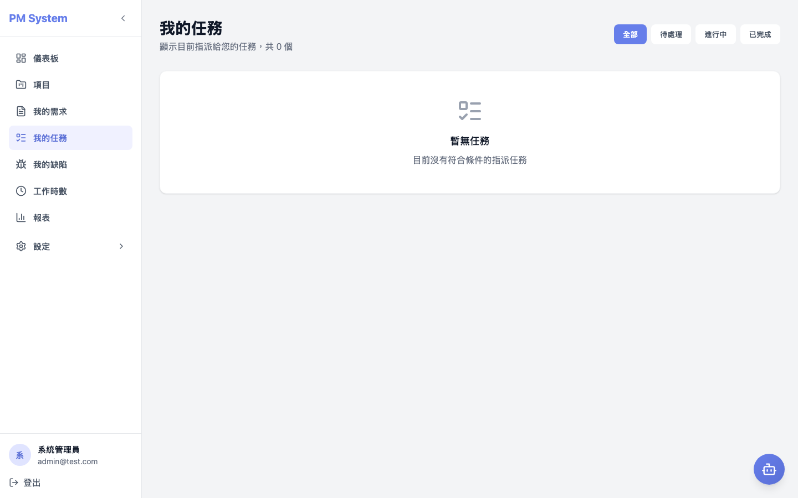

呢度係「to-do list」視角，**只顯示分配畀你嘅任務**。

### 6.2 項目入面嘅任務

去項目詳情 → 撳「**任務**」tab：

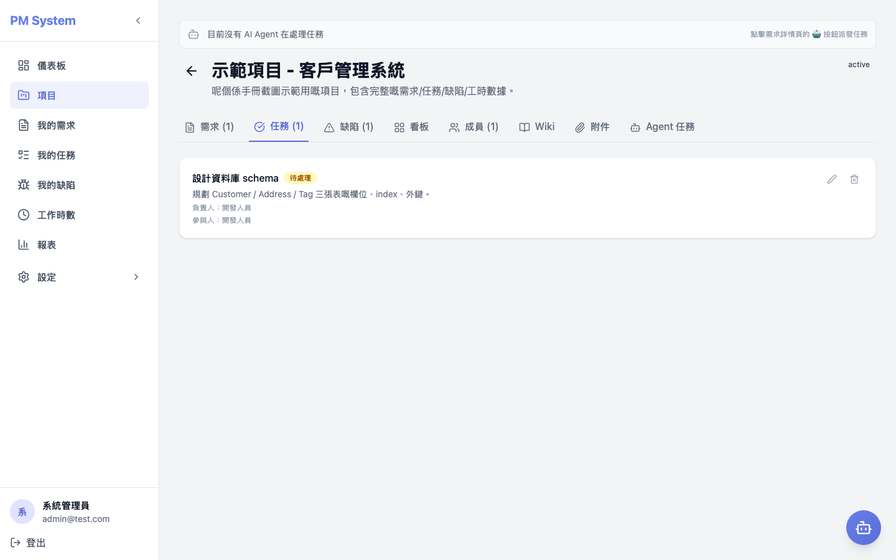

每張任務卡顯示：
- 標題
- 狀態（todo / in_progress / review / done）
- 負責人
- 關聯需求
- 創建日期

撳任務卡右邊 ✏️ 可以編輯，🗑️ 刪除。

### 6.3 看板模式

去項目詳情 → 撳「**看板**」tab，可以拖拽任務改狀態。

---

## 7. 缺陷追蹤

### 7.1 我的缺陷

撳左邊「**我的缺陷**」：

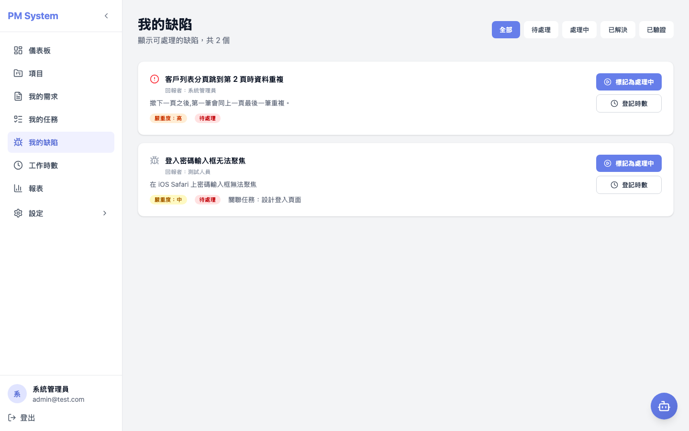

### 7.2 起新 Bug

去項目詳情 → 撳「**缺陷**」tab → 「**+ 新建缺陷**」：

填寫：
- **標題**（必填）— 例：「登入後空白頁」
- **描述**（rich text）— 重現步驟、預期 / 實際結果、截圖
- **嚴重程度**（critical / high / medium / low）
- **狀態**（open / in_progress / resolved / closed）
- **分配畀邊個**

撳「**建立**」就會加入項目缺陷列表。

---

## 8. 工作時數

### 8.1 填工時

撳左邊「**工作時數**」：

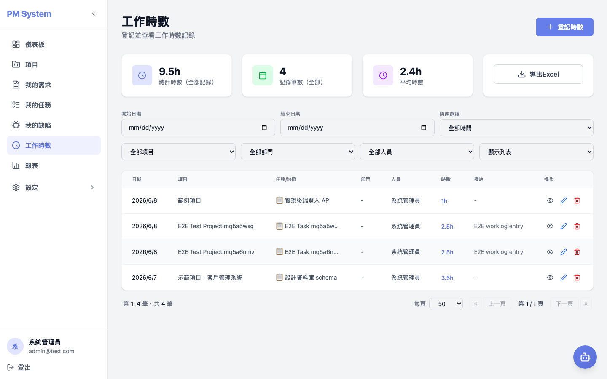

撳右上角「**+ 記錄工時**」：

填寫：
- **項目**（必填）
- **任務**（可選，但建議填，方便追蹤）
- **日期**（預設今日）
- **時數**（0.5 ~ 24 小時）
- **描述**（你做咗咩）

撳「**儲存**」。

> ⚠️ **5 號前嘅工時鎖咗**：每月 5 號之後，上個月嘅工時就唔可以再改（non-admin）。如有錯請即時聯絡 Admin。

### 8.2 工時統計

工時頁有 3 個 tab：

| Tab | 內容 |
|-----|------|
| **個人** | 你自己嘅日報 / 月報 |
| **項目** | 每個項目嘅總工時 |
| **部門** | 部門層面嘅工時統計 |

---

## 9. 報表

撳左邊「**報表**」：

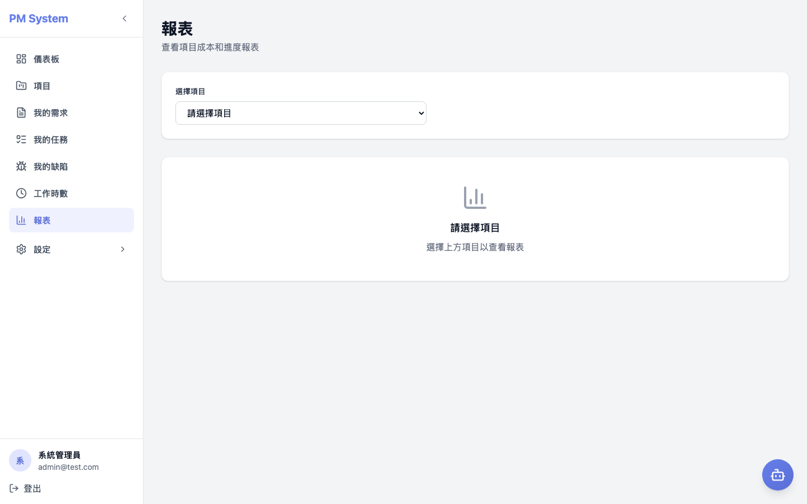

報表提供：
- **項目進度** — 各項目嘅完成率
- **產出統計** — 需求 / 任務 / bug 嘅建立 vs 關閉趨勢
- **Token 用量** — AI 助手 / Agent 用咗幾多 LLM token
- **部門對比** — 唔同部門嘅工時 / 產出

---

## 10. AI 助手（Chat）

撳左邊「**AI 助手**」（或者 chat icon）：

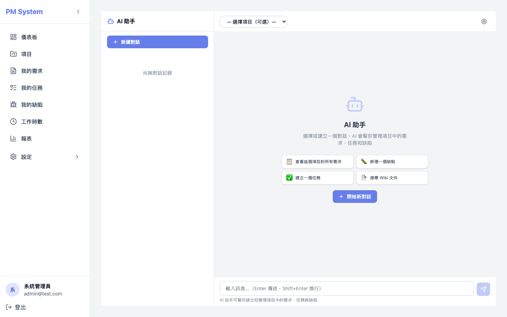

### 10.1 點用

喺下面輸入框直接打中文問題，例：

- 「呢個項目有幾多個進行中嘅任務？」
- 「幫我建一個『設計 API 文檔』嘅任務」
- 「我上週填咗幾多工時？」
- 「嗰個 bug 點解仲未修？」

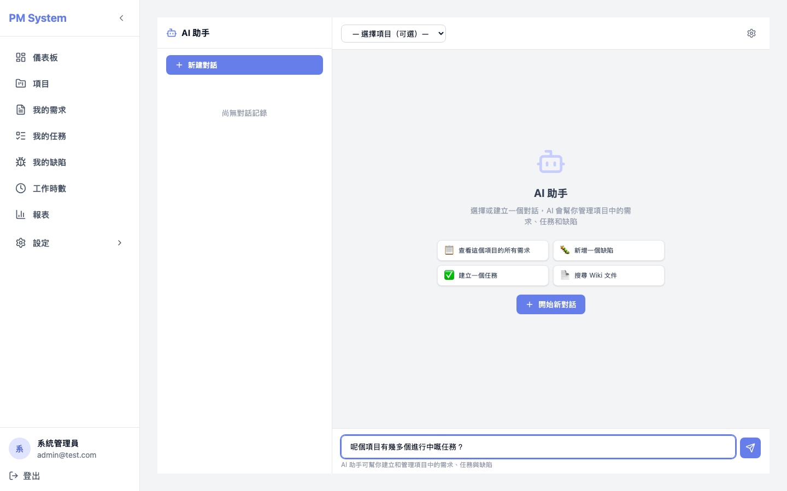

AI 助手會：
1. 理解你嘅自然語言 query
2. 查 DB 或者執行操作
3. 用廣東話 / 繁中回覆

> ⚠️ AI 助手有「**項目 scope**」— 佢只會查你當前選咗嘅項目，唔會洩露其他項目嘅資料。

---

## 11. Wiki 與文件

### 11.1 項目 Wiki

去項目詳情 → 撳「**Wiki**」tab：

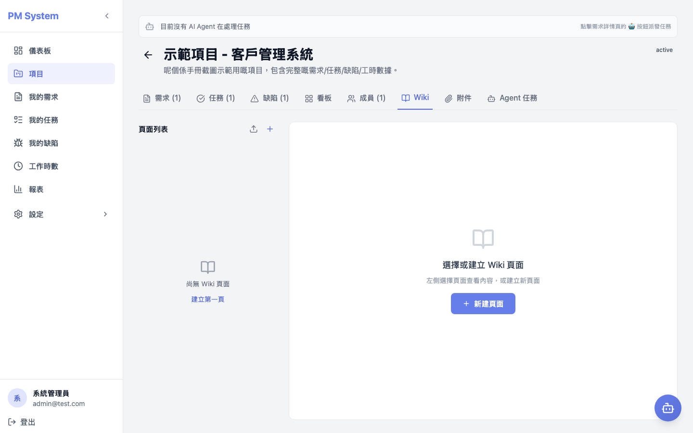

撳「**+ 新建頁面**」就會打開編輯器：

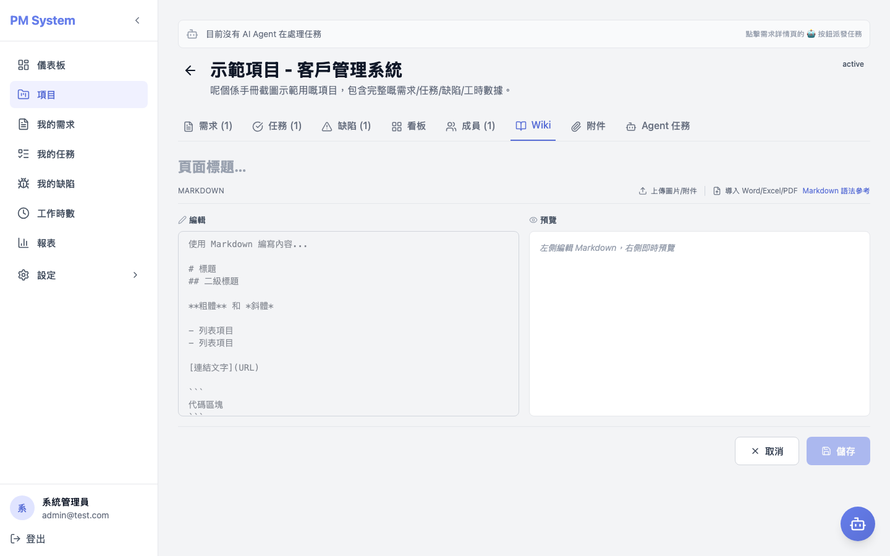

Wiki 頁面支援：
- Markdown 語法
- Tags 分類
- 歷史版本（未來功能）

> 🔒 **Wiki 係項目 scope**：唔係項目成員睇唔到。

### 11.2 文件附件

去項目詳情 → 撳「**附件**」tab，上傳 Word / Excel / PDF。系統會自動用 LLM 解析內容，可以喺 AI 助手問「呢個文件講咩」。

---

## 12. 用戶、部門、角色管理

> 🔒 **本節只適用於 Admin**。其他角色睇唔到呢啲 menu。

### 12.1 用戶管理

撳左邊「**設定 → 用戶管理**」：

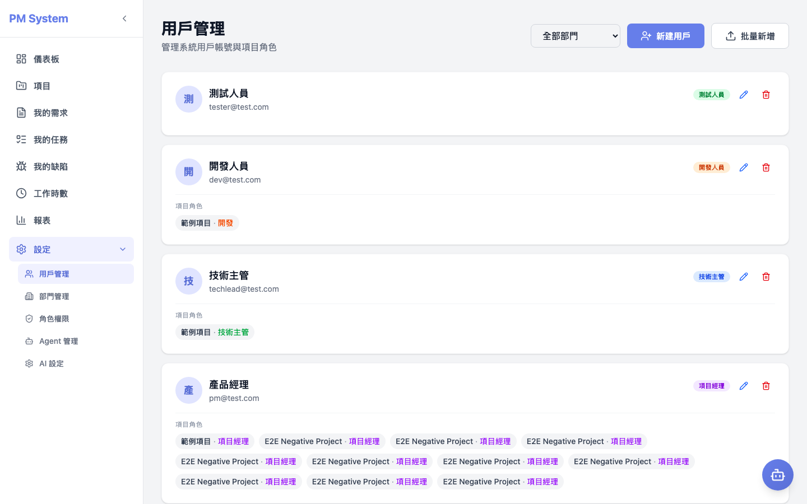

可以做：
- 撳「**+ 新建用戶**」開新帳號
- 編輯現有用戶嘅 role / 部門
- 停用帳號（軟刪除）

### 12.2 部門管理

撳「**設定 → 部門管理**」：

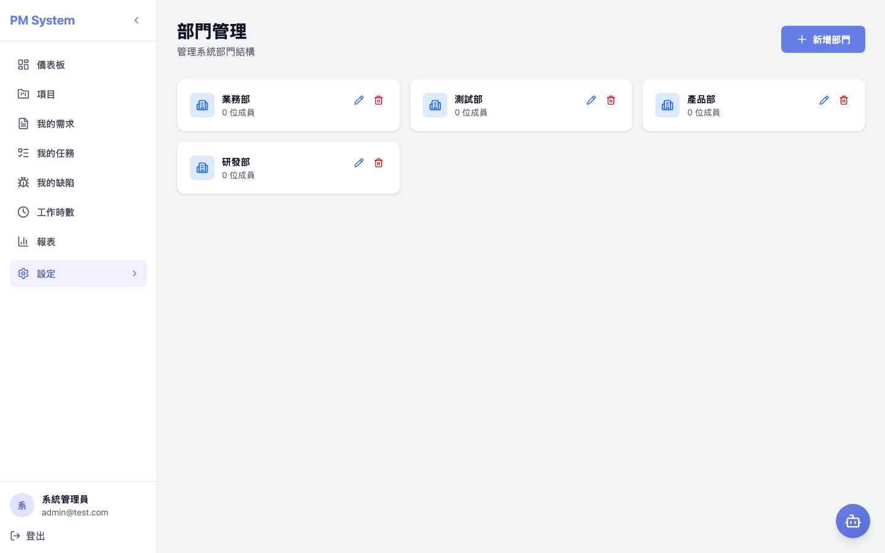

每個部門可以設：
- 名稱
- 描述
- 上級部門

### 12.3 角色權限

撳「**設定 → 角色權限**」：

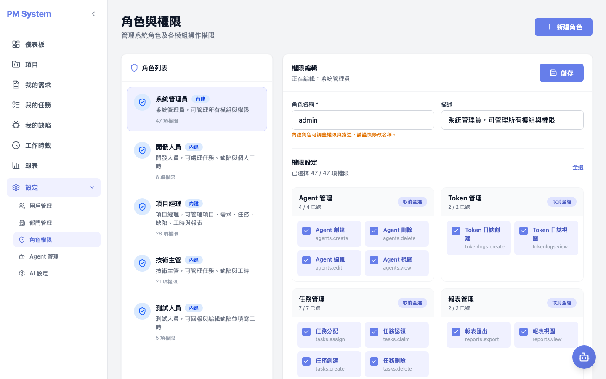

系統預設 5 個角色（Admin / PM / Tech Lead / Developer / Tester）。

撳「**編輯**」可以改角色嘅 permission：

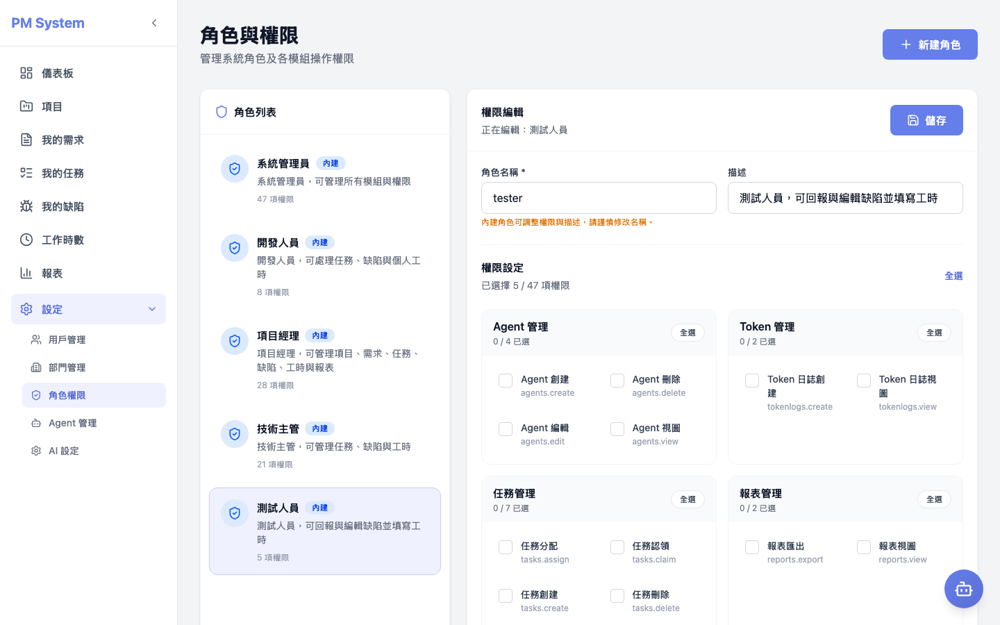

Permission 係顆粒度嘅（例如 `projects.create`、`requirements.view`），可以逐個 toggle ✅ / ❌。

> ⚠️ **改完記得撳「**儲存**」**。改完之後個 role 嘅 user 喺下次 API request 會即時見效。

> ⚠️ **改 role 之後有 cache bug（已知）**：如果你發覺 Admin 突然 403，請見 [FAQ §15.3](#153-我改完-role-之後-admin-變咗-403)。

### 12.4 自定義角色

撳「**+ 新建角色**」可以建自定義 role：
1. 輸入角色名稱
2. 揀要 enable 嘅 permission
3. 撳「**建立**」

之後可以喺「用戶管理」將呢個 role 分配畀用戶。

---

## 13. AI Agent 管理

> 🔒 **Admin** 創建 / 編輯 Agent；其他角色只可以睇 + 派工畀 Agent。

### 13.1 Agent 管理頁

撳「**設定 → Agent 管理**」：

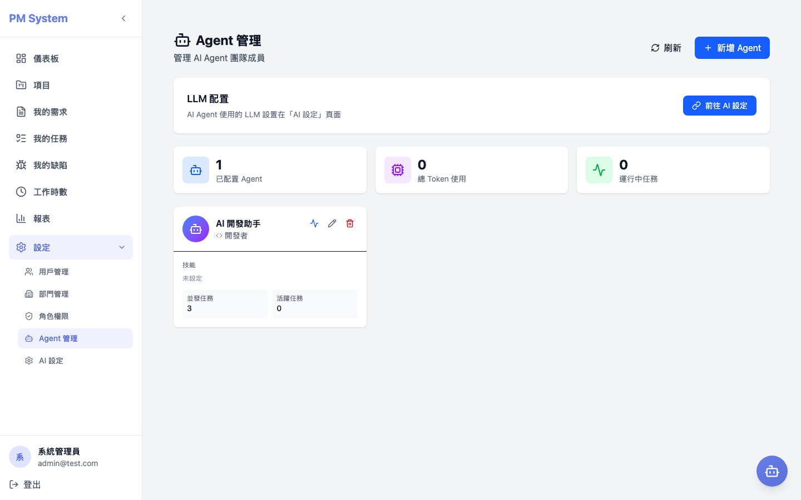

每個 Agent 顯示：
- 名稱
- 角色（developer / tester / pm / tech_lead）
- 並發任務上限
- 活躍任務數

撳右上角「**+ 新增 Agent**」可以建新 Agent。撳 ⚡ icon 睇 token 用量統計。

### 13.2 將任務派畀 Agent

去項目詳情 → 撳頂部「**Agent 派工**」綠色 banner：

可以揀「**自動派工**」或者「**手動派工**」畀指定 Agent。

### 13.3 項目 Agent tab

去項目詳情 → 撳「**Agent 任務**」tab：

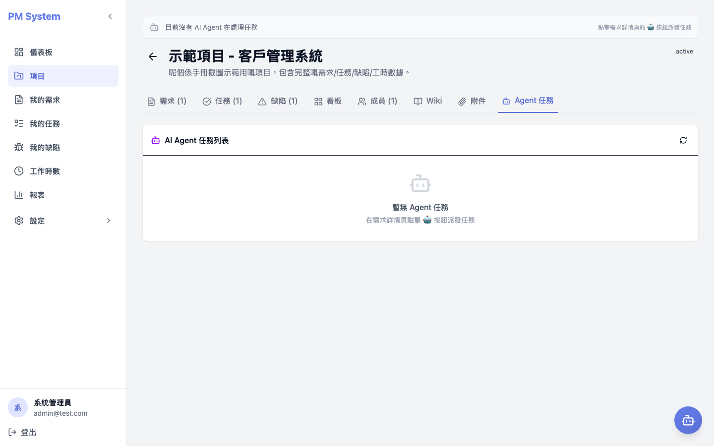

可以睇到呢個項目入面所有派畀 Agent 嘅任務狀態（claim / running / done）。

---

## 14. 角色權限（RBAC）速覽

### 14.1 默認角色 vs 權限矩陣

| | Admin | PM | Tech Lead | Developer | Tester |
|---|:-:|:-:|:-:|:-:|:-:|
| 項目 - 睇 | ✅ | ✅ | ✅ | ✅ | ✅ |
| 項目 - 建 | ✅ | ✅ | ❌ | ❌ | ❌ |
| 項目 - 刪除 | ✅ | ⚠️ own | ❌ | ❌ | ❌ |
| 需求 - 睇 | ✅ | ✅ | ✅ | ✅ | ✅ |
| 需求 - 建 | ✅ | ✅ | ✅ | ❌ | ❌ |
| 任務 - 分派 | ✅ | ✅ | ✅ | ❌ | ❌ |
| 工時 - 填 | ✅ | ✅ | ✅ | ✅ | ✅ |
| 工時 - 改 5 號前 | ✅ | ✅ | ✅ | ✅ | ✅ |
| 工時 - 改 5 號後 | ✅ | ❌ | ❌ | ❌ | ❌ |
| Bug - 起 | ✅ | ✅ | ✅ | ✅ | ✅ |
| 報表 - 睇 | ✅ | ✅ | ✅ | ⚠️ own | ⚠️ own |
| 用戶 - 管 | ✅ | ❌ | ❌ | ❌ | ❌ |
| 角色 - 管 | ✅ | ❌ | ❌ | ❌ | ❌ |
| Agent - 管 | ✅ | ❌ | ❌ | ❌ | ❌ |
| AI 設定 | ✅ | ❌ | ❌ | ❌ | ❌ |

### 14.2 Permission key 一覽

| 模組 | Permission key |
|------|----------------|
| 項目 | `projects.view` / `projects.create` / `projects.edit` / `projects.delete` |
| 需求 | `requirements.view` / `requirements.create` / `requirements.edit` / `requirements.delete` |
| 任務 | `tasks.view` / `tasks.create` / `tasks.edit` / `tasks.delete` |
| 缺陷 | `bugs.view` / `bugs.create` / `bugs.edit` / `bugs.delete` |
| 工時 | `worklogs.view` / `worklogs.create` / `worklogs.edit` / `worklogs.delete` |
| 報表 | `reports.view` |
| 用戶 | `users.view` / `users.create` / `users.edit` / `users.delete` |
| 角色 | `roles.view` / `roles.create` / `roles.edit` / `roles.delete` |
| 部門 | `departments.view` / `departments.create` / `departments.edit` / `departments.delete` |
| 部門管理 | `users.view` (sharing) |

---

## 15. 常見問題 FAQ

### 15.1 我見唔到「項目」、「任務」等 menu

**原因**：你嘅 role 冇對應 permission。

**解決**：
1. 聯絡 Admin
2. Admin 去「**設定 → 用戶管理**」改你嘅 role
3. 重新登入就見到

### 15.2 我 build 唔到任務 / 需求

**原因**：可能係：
- 冇 `*.create` permission（聯絡 Admin）
- 唔係項目成員（要 PM 加你入嚟）

### 15.3 我改完 role 之後 Admin 變咗 403

**原因**：已知 bug — `rolePermissionCache` 喺 backend 改完 role 之後冇自動 refresh（詳見 `docs/TECH-DEBT.md`）。

**臨時 workaround**：
```bash
# 重啟 backend container
cd ~/www/pm-system
docker compose restart backend
```

之後就會 reload 權限 cache。

### 15.4 工時改唔到

**原因**：
- 5 號前嘅工時 lock 咗（non-admin）— 聯絡 Admin
- 冇 `worklogs.edit` permission

### 15.5 個 AI Agent 唔郁

**原因**：
- 個 Agent 可能冇 token — 去「**AI 設定**」check
- LLM config 未填 — 去「**Agent 管理 → LLM 配置**」確認

### 15.6 點解我用 Admin 都見唔到 `/agents`？

**原因**：`/agents` page 只顯示 `admin` role。檢查：

```bash
# 喺 DB check
docker exec pm-system-db-1 psql -U pmuser -d pmdb \
  -c "SELECT email, role FROM users WHERE email = 'admin@test.com';"
```

如果 role 唔係 `admin`，搵 DB 改：
```sql
UPDATE users SET role = 'admin' WHERE email = 'admin@test.com';
```

### 15.7 我哋公司冇見到呢個系統

PM System 而家只係 **內部 Dev 環境**。生產部署 URL / 訪問權限要問 IT。

---

## 附錄 A：截圖清單

| # | 檔案 | 內容 |
|---|------|------|
| 01 | `01-login.png` | 登入頁 |
| 02 | `02-dashboard.png` | 儀表板 |
| 03 | `03-projects.png` | 項目列表 |
| 04 | `04-project-detail.png` | 項目詳情 |
| 05 | `05-my-requirements.png` | 我的需求 |
| 06 | `06-my-tasks.png` | 我的任務 |
| 07 | `07-my-bugs.png` | 我的缺陷 |
| 08 | `08-work-logs.png` | 工作時數 |
| 09 | `09-reports.png` | 報表 |
| 10 | `10-profile.png` | 個人資料 |
| 11 | `11-chat.png` | AI 助手 |
| 12 | `12-wiki.png` | Wiki tab |
| 13 | `13-requirement-detail.png` | 需求詳情 |
| 14 | `14-task-detail.png` | 項目任務 tab |
| 15 | `15-users.png` | 用戶管理 |
| 16 | `16-departments.png` | 部門管理 |
| 17 | `17-roles.png` | 角色權限 |
| 18 | `18-agents.png` | Agent 管理 |
| 19 | `19-project-agents-tab.png` | 項目 Agent tab |
| 20 | `20-settings.png` | AI 設定 |
| 21 | `21-create-project-modal.png` | 新建項目 modal |
| 22 | `22-wiki-tab.png` | Wiki 列表 |
| 23 | `23-wiki-editor.png` | Wiki 編輯器 |
| 24 | `24-roles-page.png` | 角色權限頁 |
| 25 | `25-role-edit-modal.png` | 編輯角色 modal |
| 26 | `26-chat-prompt.png` | AI Chat 輸入 |

---

## 附錄 B：術語表

| 術語 | 解釋 |
|------|------|
| **項目 (Project)** | 一個 product / initiative，內含多個需求 |
| **需求 (Requirement)** | 要解決嘅一個問題，有優先級同狀態 |
| **任務 (Task)** | 將需求拆細成可執行嘅工作單位 |
| **缺陷 (Bug)** | 開發過程中發現嘅問題 |
| **工時 (WorkLog)** | 同事填報嘅每日工作時數 |
| **Agent** | AI 自動工人，可以 claim + 執行任務 |
| **Wiki** | 項目內部嘅 Markdown 文檔 |
| **RBAC** | Role-Based Access Control，角色權限控制 |
| **Permission** | 一個具體操作嘅權限 key，例如 `projects.create` |

---

## 附錄 C：技術支援

| 問題類型 | 搵邊個 |
|---------|--------|
| 帳號 / 權限問題 | Admin / IT |
| 系統 bug | 開 Bug ticket（缺陷 tab） |
| 功能建議 | 開需求 ticket（需求 tab） |
| 緊急事故 | Discord `#pm-system-alerts` |

---

**版本**：v1.0 (2026-06-08)
**對應系統版本**：PM System v1.x
**下次更新**：每次新增 / 修改主要 page
