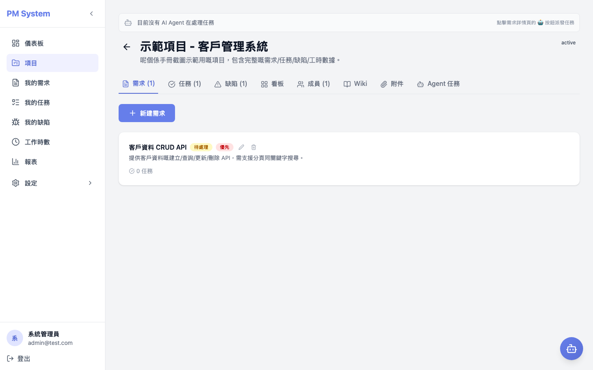

# PM System — 用户使用手册

> **适用对象**：所有 PM System 用户（管理员 / 项目经理 / 技术负责人 / 开发人员 / 测试人员）
> **目的**：分步骤教学，每个页面均附截图说明
> **更新日期**：2026-06-09
> **系统网址**：`http://localhost:8080`（Docker 本地环境）／ `https://pm.your-company.com`（生产环境，待部署）

---

## 目录

1. [快速开始](#1-快速开始)
2. [登录与个人资料](#2-登录与个人资料)
3. [仪表板](#3-仪表板)
4. [项目管理](#4-项目管理)
5. [需求管理](#5-需求管理)
6. [任务管理](#6-任务管理)
7. [缺陷追踪](#7-缺陷追踪)
8. [工作时间记录](#8-工作时间记录)
9. [报表](#9-报表)
10. [AI 助手（对话）](#10-ai-助手对话)
11. [Wiki 与文件](#11-wiki-与文件)
12. [用户、部门和角色管理](#12-用户部门和角色管理)
13. [AI Agent 管理](#13-ai-agent-管理)
14. [角色权限（RBAC）速览](#14-角色权限rbac-速览)
15. [常见问题](#15-常见问题)

---

## 1. 快速开始

### 1.1 系统简介

PM System 是公司内部的项目管理平台，集中管理以下内容：

- **项目** — 每一个产品或工作计划
- **需求** — 每个项目需要解决的问题
- **任务** — 将需求拆解为可执行的工作单元
- **缺陷** — 开发过程中发现的错误
- **工作时间** — 员工填写的每日工作记录
- **AI 助手** — 通过自然语言操作上述所有内容

### 1.2 准备工作

| 项目 | 获取方式 |
|------|----------|
| 浏览器 | Chrome / Edge / Safari（建议使用最新版本） |
| 账号 | 联系管理员开通 |
| 密码 | 首次登录后请前往 [个人资料] 修改 |

### 1.3 角色与权限概述

| 角色 | 默认权限 |
|------|----------|
| **管理员（Admin）** | 全部操作权限，包括开通用户、修改角色 |
| **项目经理（PM）** | 管理项目、创建需求、分配任务、查看报表 |
| **技术负责人（Tech Lead）** | 分配任务、审批需求 |
| **开发人员（Developer）** | 查看并更新自己的任务、填写工作时间 |
| **测试人员（Tester）** | 查看全部内容并创建缺陷 |
| **自定义角色** | 管理员在「角色权限」页面中自行配置 |

详细的权限键请参见 [第 14 节](#14-角色权限rbac-速览)。

---

## 2. 登录与个人资料

### 2.1 登录

打开系统网址后，将看到登录页面：


**操作步骤**：

1. 输入 **电子邮件**（由管理员提供）
2. 输入 **密码**
3. 点击「**登录**」按钮

> ⚠️ **如果页面中没有显示「项目」等菜单**：说明您的角色没有对应的权限。请联系管理员修改角色（参见 [第 12.3 节](#123-角色权限)）。

### 2.2 默认测试账号（仅限开发环境使用）

| 角色 | 邮箱 | 密码 |
|------|------|------|
| 管理员 | `admin@test.com` | `admin123` |
| 项目经理 | `pm@test.com` | `pm123` |
| 技术负责人 | `techlead@test.com` | `tl123` |
| 开发人员 | `dev@test.com` | `dev123` |
| 测试人员 | `tester@test.com` | `test123` |
| AI 代理 | `agent-dev1@test.com` | `agent123` |

> 🔒 **生产环境不会存在上述账号**。这些账号仅用于开发环境的种子数据。

### 2.3 个人资料页面

点击左下角的姓名区域，进入「个人资料」：


在此页面中可以修改：

- 显示名称
- 头像
- 密码
- 通知偏好

---

## 3. 仪表板

登录后首先看到的是「仪表板」页面：


仪表板集中展示以下信息：

| 区域 | 内容 |
|------|------|
| **项目概览** | 您参与中的项目卡片，包含状态、进度、成员数量 |
| **待办任务** | 分配给您且尚未完成的任务 |
| **最近活动** | 系统及同事的最新动态 |
| **本周工时** | 本周已填写工时与目标工时的对比 |

---

## 4. 项目管理

### 4.1 项目列表

点击左侧菜单中的「**项目**」：


每个项目卡片显示以下信息：

- 项目名称及状态（active / paused / completed）
- 所属部门
- 成员数量 / 需求数量
- 创建日期

### 4.2 新建项目

点击右上角的「**+ 新建项目**」按钮，将弹出对话框：


需要填写以下内容：

- **名称**（必填）— 例如：「客户管理系统 v2」
- **描述** — 项目目标及范围说明
- **状态** — 默认为 `active`
- **部门** — 选择所属部门（可选项）

点击「**创建**」按钮完成创建。

### 4.3 项目详情

点击项目卡片进入详情页面，可以看到 8 个标签页：

| 标签页 | 内容 |
|--------|------|
| **需求** | 项目中所有需求的列表 |
| **任务** | 项目中所有任务的列表 |
| **缺陷** | 项目中所有缺陷的列表 |
| **看板** | 看板视图，支持任务拖拽管理 |
| **成员** | 项目成员及其角色 |
| **Wiki** | 项目 Wiki 页面 |
| **附件** | 上传的文件 |
| **Agent 任务** | 分配给 AI 代理的任务 |


页面顶部有一个 **Agent 派工横幅**（绿色），可以将任务分配给 AI 代理自动执行。

---

## 5. 需求管理

### 5.1 我的需求

点击左侧菜单中的「**我的需求**」：


此页面仅显示「**分配给您或由您创建的**」需求。每个需求卡片显示：

- 标题
- 优先级（high / medium / low）
- 状态（draft / open / in_progress / completed / cancelled）
- 创建日期

### 5.2 需求详情

点击需求卡片进入详情页面：


可以执行以下操作：

- 修改标题或描述（支持富文本编辑器）
- 修改优先级和状态
- 分配负责人
- 将需求转换为任务（拆解为可执行工作）

---

## 6. 任务管理

### 6.1 我的任务

点击左侧菜单中的「**我的任务**」：


此页面以「待办事项」视角呈现，**仅显示分配给您的任务**。

### 6.2 项目内的任务

进入项目详情后，点击「**任务**」标签页：


每个任务卡片显示：

- 标题
- 状态（todo / in_progress / review / done）
- 负责人
- 关联需求
- 创建日期

点击任务卡片右侧的 ✏️ 图标可以编辑，点击 🗑️ 图标可以删除。

### 6.3 看板模式

进入项目详情后，点击「**看板**」标签页，可以通过拖拽方式修改任务状态。

---

## 7. 缺陷追踪

### 7.1 我的缺陷

点击左侧菜单中的「**我的缺陷**」：


### 7.2 创建新缺陷

进入项目详情后，点击「**缺陷**」标签页，再点击「**+ 新建缺陷**」：

需要填写以下内容：

- **标题**（必填）— 例如：「登录后显示空白页」
- **描述**（支持富文本）— 复现步骤、预期与实际结果、相关截图
- **严重程度**（critical / high / medium / low）
- **状态**（open / in_progress / resolved / closed）
- **分配对象**

点击「**创建**」按钮后，该缺陷将加入项目的缺陷列表。

---

## 8. 工作时间记录

### 8.1 填写工时

点击左侧菜单中的「**工作时间**」：


点击右上角的「**+ 记录工时**」按钮：

需要填写以下内容：

- **项目**（必填）
- **任务**（可选项，但建议填写以便追踪）
- **日期**（默认为今日）
- **工时**（0.5 至 24 小时）
- **描述**（您完成的工作内容）

点击「**保存**」按钮。

> ⚠️ **5 号之前的工时已被锁定**：每月 5 号之后，上个月的工时将无法再修改（非管理员）。如需更正，请及时联系管理员。

### 8.2 工时统计

工时页面包含 3 个标签页：

| 标签页 | 内容 |
|--------|------|
| **个人** | 您个人的日报和月报 |
| **项目** | 每个项目的总工时 |
| **部门** | 部门层面的工时统计 |

---

## 9. 报表

点击左侧菜单中的「**报表**」：


报表提供以下内容：

- **项目进度** — 各项目的完成率
- **产出统计** — 需求、任务、缺陷的创建与关闭趋势
- **Token 使用量** — AI 助手和代理使用的 LLM Token 数量
- **部门对比** — 不同部门的工时与产出对比

---

## 10. AI 助手（对话）

点击左侧菜单中的「**AI 助手**」（或对话图标）：


### 10.1 使用方法

在页面下方的输入框中直接输入中文问题，例如：

- 「该项目当前有多少进行中的任务？」
- 「请帮我创建一个『设计 API 文档』的任务」
- 「我上周填写了多少工时？」
- 「那个缺陷为什么还没有修复？」


AI 助手将会：

1. 理解您的自然语言问题
2. 查询数据库或执行相应操作
3. 使用中文回复

> ⚠️ AI 助手具有「**项目范围限制**」— 只会查询您当前选定的项目数据，不会泄露其他项目的信息。

---

## 11. Wiki 与文件

### 11.1 项目 Wiki

进入项目详情后，点击「**Wiki**」标签页：



点击「**+ 新建页面**」按钮即可打开编辑器：


Wiki 页面支持以下功能：

- Markdown 语法
- 标签分类
- 历史版本（未来功能）

> 🔒 **Wiki 属于项目范围**：非项目成员无法查看。

### 11.2 文件附件

进入项目详情后，点击「**附件**」标签页，可上传 Word、Excel、PDF 等文件。系统将自动使用大语言模型解析文件内容，您可以在 AI 助手中询问「该文件讲述了什么内容」。

---

## 12. 用户、部门和角色管理

> 🔒 **本节仅适用于管理员**。其他角色无法看到相关菜单。

### 12.1 用户管理

点击左侧菜单中的「**设置 → 用户管理**」：


可以执行以下操作：

- 点击「**+ 新建用户**」开通新账号
- 编辑现有用户的角色或部门
- 停用账号（软删除）

### 12.2 部门管理

点击「**设置 → 部门管理**」：


每个部门可以设置：

- 名称
- 描述
- 上级部门

### 12.3 角色权限

点击「**设置 → 角色权限**」：


系统预置 5 个角色（管理员 / 项目经理 / 技术负责人 / 开发人员 / 测试人员）。

点击「**编辑**」按钮可以修改角色的权限：


权限的颗粒度较细（例如 `projects.create`、`requirements.view`），可以逐个切换启用状态 ✅ / ❌。

> ⚠️ **修改完成后请务必点击「**保存**」按钮**。修改后，相应角色的用户在下次 API 请求时将立即看到效果。

> ⚠️ **修改角色后存在缓存缺陷（已知问题）**：如果您发现管理员账号突然出现 403 错误，请参见 [常见问题 §15.3](#153-我修改完角色之后管理员账号出现-403-错误)。

### 12.4 自定义角色

点击「**+ 新建角色**」按钮可以创建自定义角色：

1. 输入角色名称
2. 选择需要启用的权限
3. 点击「**创建**」按钮

创建后即可在「用户管理」页面中将该角色分配给用户。

---

## 13. AI Agent 管理

> 🔒 **管理员**可创建或编辑代理；其他角色仅可查看并向代理分配任务。

### 13.1 代理管理页面

点击「**设置 → Agent 管理**」：


每个代理显示以下信息：

- 名称
- 角色（developer / tester / pm / tech_lead）
- 并发任务上限
- 当前活跃任务数

点击右上角的「**+ 新增 Agent**」可以创建新代理。点击 ⚡ 图标可查看 Token 使用量统计。

> 💡 **关于 AI 设置**：系统的 AI 模型配置位于「**设置 → AI 设置**」页面（[见截图](screenshots/20-settings.png)），包括默认模型、Token 限额、提示词模板等。

### 13.2 将任务分配给代理

进入项目详情后，点击顶部的「**Agent 派工**」绿色横幅：

可以选择「**自动派工**」或「**手动派工**」将任务分配给指定的代理。

### 13.3 项目代理标签

进入项目详情后，点击「**Agent 任务**」标签页：


可以查看该项目内所有分配给代理的任务状态（claim / running / done）。

---

## 14. 角色权限（RBAC）速览

### 14.1 默认角色与权限矩阵

| 权限项 | 管理员 | 项目经理 | 技术负责人 | 开发人员 | 测试人员 |
|--------|:------:|:--------:|:----------:|:--------:|:--------:|
| 项目 - 查看 | ✅ | ✅ | ✅ | ✅ | ✅ |
| 项目 - 创建 | ✅ | ✅ | ❌ | ❌ | ❌ |
| 项目 - 删除 | ✅ | ⚠️ 仅限本项目 | ❌ | ❌ | ❌ |
| 需求 - 查看 | ✅ | ✅ | ✅ | ✅ | ✅ |
| 需求 - 创建 | ✅ | ✅ | ✅ | ❌ | ❌ |
| 任务 - 分配 | ✅ | ✅ | ✅ | ❌ | ❌ |
| 工时 - 填写 | ✅ | ✅ | ✅ | ✅ | ✅ |
| 工时 - 修改 5 号前 | ✅ | ✅ | ✅ | ✅ | ✅ |
| 工时 - 修改 5 号后 | ✅ | ❌ | ❌ | ❌ | ❌ |
| 缺陷 - 创建 | ✅ | ✅ | ✅ | ✅ | ✅ |
| 报表 - 查看 | ✅ | ✅ | ✅ | ⚠️ 仅限本人 | ⚠️ 仅限本人 |
| 用户 - 管理 | ✅ | ❌ | ❌ | ❌ | ❌ |
| 角色 - 管理 | ✅ | ❌ | ❌ | ❌ | ❌ |
| 代理 - 管理 | ✅ | ❌ | ❌ | ❌ | ❌ |
| AI 设置 | ✅ | ❌ | ❌ | ❌ | ❌ |

### 14.2 权限键一览

| 模块 | 权限键 |
|------|--------|
| 项目 | `projects.view` / `projects.create` / `projects.edit` / `projects.delete` |
| 需求 | `requirements.view` / `requirements.create` / `requirements.edit` / `requirements.delete` |
| 任务 | `tasks.view` / `tasks.create` / `tasks.edit` / `tasks.delete` |
| 缺陷 | `bugs.view` / `bugs.create` / `bugs.edit` / `bugs.delete` |
| 工时 | `worklogs.view` / `worklogs.create` / `worklogs.edit` / `worklogs.delete` |
| 报表 | `reports.view` |
| 用户 | `users.view` / `users.create` / `users.edit` / `users.delete` |
| 角色 | `roles.view` / `roles.create` / `roles.edit` / `roles.delete` |
| 部门 | `departments.view` / `departments.create` / `departments.edit` / `departments.delete` |

---

## 15. 常见问题

### 15.1 我看不到「项目」「任务」等菜单

**原因**：您的角色没有对应的权限。

**解决方法**：

1. 联系管理员
2. 管理员前往「**设置 → 用户管理**」修改您的角色
3. 重新登录后即可看到

### 15.2 我无法创建任务或需求

**原因**：可能存在以下情况：

- 没有 `*.create` 权限（请联系管理员）
- 不是项目成员（需要由项目经理添加到项目成员中）

### 15.3 我修改完角色之后管理员账号出现 403 错误

**原因**：已知缺陷 — 后端的 `rolePermissionCache` 在修改角色后不会自动刷新（详见 `docs/TECH-DEBT.md`）。

**临时解决方案**：

```bash
# 重启后端容器
cd ~/www/pm-system
docker compose restart backend
```

重启后将重新加载权限缓存。

### 15.4 无法修改工时

**原因**：

- 5 号之前的工时已被锁定（非管理员）— 请联系管理员
- 没有 `worklogs.edit` 权限

### 15.5 AI 代理没有响应

**原因**：

- 代理可能没有配置 Token — 请前往「**AI 设置**」检查
- 未填写 LLM 配置 — 请前往「**代理管理 → LLM 配置**」确认

### 15.6 为什么我使用管理员账号也看不到 `/agents` 页面？

**原因**：`/agents` 页面仅对 `admin` 角色显示。请检查：

```bash
# 在数据库中检查
docker exec pm-system-db-1 psql -U pmuser -d pmdb \
  -c "SELECT email, role FROM users WHERE email = 'admin@test.com';"
```

如果角色不是 `admin`，请通过数据库修改：

```sql
UPDATE users SET role = 'admin' WHERE email = 'admin@test.com';
```

### 15.7 公司内部无法访问此系统

PM System 目前仅部署在 **内部开发环境**。生产环境的部署 URL 和访问权限请联系 IT 部门。

---

## 附录 A：截图清单

| 编号 | 文件名 | 内容 |
|------|--------|------|
| 01 | `01-login.png` | 登录页面 |
| 02 | `02-dashboard.png` | 仪表板 |
| 03 | `03-projects.png` | 项目列表 |
| 04 | `04-project-detail.png` | 项目详情 |
| 05 | `05-my-requirements.png` | 我的需求 |
| 06 | `06-my-tasks.png` | 我的任务 |
| 07 | `07-my-bugs.png` | 我的缺陷 |
| 08 | `08-work-logs.png` | 工作时间 |
| 09 | `09-reports.png` | 报表 |
| 10 | `10-profile.png` | 个人资料 |
| 11 | `11-chat.png` | AI 助手 |
| 12 | `12-wiki.png` | Wiki 标签 |
| 13 | `13-requirement-detail.png` | 需求详情 |
| 14 | `14-task-detail.png` | 项目任务标签 |
| 15 | `15-users.png` | 用户管理 |
| 16 | `16-departments.png` | 部门管理 |
| 17 | `17-roles.png` | 角色权限 |
| 18 | `18-agents.png` | 代理管理 |
| 19 | `19-project-agents-tab.png` | 项目代理标签 |
| 20 | `20-settings.png` | AI 设置 |
| 21 | `21-create-project-modal.png` | 新建项目对话框 |
| 22 | `22-wiki-tab.png` | Wiki 列表（参考截图） |
| 23 | `23-wiki-editor.png` | Wiki 编辑器 |
| 24 | `24-roles-page.png` | 角色权限页面（参考截图） |
| 25 | `25-role-edit-modal.png` | 编辑角色对话框 |
| 26 | `26-chat-prompt.png` | AI 对话输入 |

---

## 附录 B：术语表

| 术语 | 解释 |
|------|------|
| **项目（Project）** | 一个产品或工作计划，包含多个需求 |
| **需求（Requirement）** | 需要解决的某个问题，具有优先级和状态 |
| **任务（Task）** | 将需求拆解为可执行的工作单元 |
| **缺陷（Bug）** | 开发过程中发现的问题 |
| **工时（WorkLog）** | 员工填写的每日工作记录 |
| **代理（Agent）** | AI 自动化工作者，可以领取并执行任务 |
| **Wiki** | 项目内部的 Markdown 文档 |
| **RBAC** | 基于角色的访问控制（Role-Based Access Control） |
| **权限（Permission）** | 一个具体操作的权限键，例如 `projects.create` |

---

## 附录 C：技术支持

| 问题类型 | 联系方式 |
|---------|----------|
| 账号或权限问题 | 管理员 / IT 部门 |
| 系统缺陷 | 提交缺陷工单（缺陷标签页） |
| 功能建议 | 提交需求工单（需求标签页） |
| 紧急事故 | Discord `#pm-system-alerts` 频道 |

---

**版本**：v1.1（2026-06-09）
**对应系统版本**：PM System v1.x
**下次更新**：每次新增或修改主要页面
